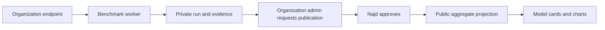

# Database-backed results and Evaluation as a Service

Najd Arena reads public model identity, configurations, task results, answer-quality counts, and inference samples from PostgreSQL. Adding a model does not require editing a React component.

## Data boundaries

| Record | Purpose | Default visibility |
|---|---|---|
| `model_catalog` | Display name, slug, provider, logo, color, verified specifications, optional owning organization | Private |
| `evaluation_releases` | One comparable dataset revision and scoring protocol, plus provenance | Private |
| `evaluation_results` | A model/configuration aggregate, task breakdown, optional operational metrics and source run | Private |
| `runs`, `case_results`, `run_credentials` | Organization execution, progress, private evidence references, encrypted credentials | Membership restricted |

The public reader requires **all three catalog records** to be public. It serves the latest public release with visible results, keeping incompatible releases out of one comparison. This first version does not combine historical acceptable-answer rates with the canonical macro score. A release selector and adapters for future scoring protocols are follow-up work.

## Existing result import

Deployment uses `ARENA_SEED_HISTORICAL=true` for the initial import. The import verifies the compressed grade seed checksum, matches source grade/evidence hashes, reconciles acceptable counts and totals, and creates the database catalog once. Seed files are migration input, not runtime UI imports. They contain aggregates/grade labels, never raw answers or prompts. Subsequent starts do not reset visibility decisions.

Run `DATABASE_URL=... ARENA_SEED_HISTORICAL=true node web/db/migrate.mjs` from the repository root. Turn off the seed flag after verifying the first deployment. The importer and migrations are transactional. Back up production before subsequent schema changes.

Verification from `web/`: `DATABASE_URL=... pnpm exec tsx scripts/verify-catalog.ts`. The test rolls back its fixtures and checks source totals, third-model discovery, and model/result/release visibility.

## Company evaluation policy

Runs remain private by default. An organization administrator can request publication for a completed run via `POST /api/runs/:id/publication`. The Najd admin publication endpoint requires that request, full completion, and full coverage. Publication and the review/audit records commit together. Existing canonical runs publish to their separate leaderboard; automatic projection of those scores into the general catalog is not enabled yet.

The first public deployment is the result catalog. Self-service company execution is not production-ready until OAuth, Redis/workers, artifact storage, judge credentials, quotas, and end-to-end tenant isolation have been configured and verified. Keep organization approval quotas disabled until then.

## Next service milestones

| Milestone | Acceptance evidence |
|---|---|
| Private company evaluation | An approved test organization submits an endpoint; worker finishes; another organization cannot access run or artifacts; token is removed after inference |
| Actionable insights | Task-level weaknesses, failure taxonomy, evidence examples, and comparison against the same baseline protocol; distinguish model, prompt, retrieval, and harness failures |
| Improvement loop | Versioned prompt/model/harness change rerun on a fixed holdout; report quality, coverage, failure rate, cost, and latency with sample scope |
| Controlled publication | Organization explicitly requests publication; Najd approves; only allowlisted aggregates project to the public catalog; hiding a record removes it from public reads |
| Commercial operation | Agreed retention/deletion policy, metering, billing, service limits, and operational monitoring |

A higher score alone is not a diagnosis. Recommendations should cite observed failures and propose a measurable intervention, with a follow-up run to test whether it helped.

## Publication approval and date

Publication requires explicit consent by an organization administrator and approval by at least one Najd Arena administrator. Organization consent records `publication_requested_by/at`; Najd approval records `najd_approved_by/at`. The existing request endpoint now represents explicit organization approval. The UI labels that action **Approve public publication**. Najd's final action is **Approve & publish**.

A database constraint blocks new published runs unless both approvals and `published_at` are present. Public queries also exclude unapproved legacy runs and catalog projections linked to unapproved runs. Najd approval, publication, review, and audit writes occur in one transaction. Publication is immediate after the second approval; scheduled publication is not implemented.

The public date is the actual publication timestamp, formatted in the Riyadh time zone. Model comparisons, release rows, and canonical run pages show it. Historical imports with no verified publication timestamp display **Publication date not recorded**. Import dates and evaluation dates must not be substituted.
