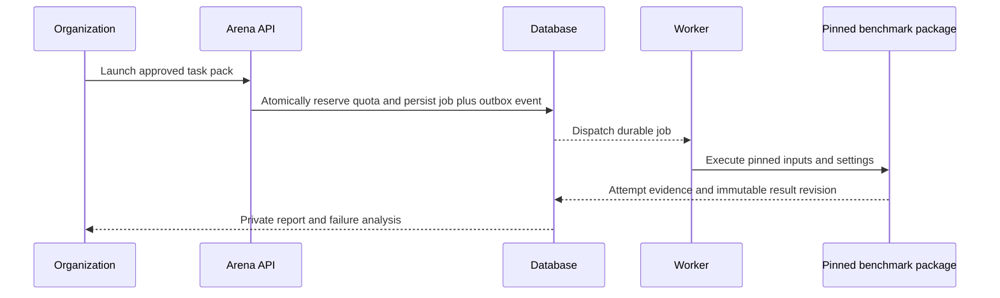

# Managed evaluations — implementation plan

Arena lets an approved organization evaluate a model privately, understand its failures, and choose whether to publish. The first pilot is Najd's own Arabic customer-support version comparison. Hands-on changes to client datasets, prompts, harnesses or models are a separate service.

This is an implementation target, not a statement that the subdomains or controls below are live. The authoritative execution and result boundary is [benchmark contract v2](https://github.com/najdresearch/benchmark/blob/codex/evaluation-contract/docs/evaluation-contract-v2.md).

## Product surfaces

| Host | Audience | Primary flow |
|---|---|---|
| najdarena.com | Public visitors | Compare published model/task results and inspect methodology |
| platform.najdarena.com | Organization admins and members | Connect endpoint, choose approved task pack, see quota/cost estimate, launch, inspect private report |
| admin.najdarena.com | Najd admins and moderators | Verify organizations, manage quotas/catalog, investigate evidence and review publication |

Hostnames organize the UI; authorization must be enforced on every server operation and artifact request. An authenticated user is not automatically an approved organization. Membership removal must revoke access. Moderators can investigate and recommend; publication requires a Najd admin.

## Launch and execution

Approved organizations self-launch approved packs within quota. Reserve concurrent runs and usage atomically; idempotency keys prevent double launches. Store encrypted credentials with least-privilege worker access and redact upstream errors. Validate endpoints against SSRF, including redirect/DNS behavior. No API secrets in audit exports.

Use a transactional outbox for database-to-queue delivery. Workers need leases, pending-message reclamation, bounded retries and idempotent case/finalization writes. Finalization verifies the expected unique case manifest; queue completion alone is insufficient. Store the benchmark package version/hash, dataset revision, prompt, harness, request settings, outputs and grader evidence.

## Publication rules

| Evaluation origin | Required authorization |
|---|---|
| Organization-submitted, website-managed | Organization admin approval AND at least one Najd admin approval for the exact result revision |
| Independently initiated Najd managed run | Najd admin review; label independent; no provider endorsement implied |
| CLI/imported results | Ineligible for public Arena reporting; development reports only |

Default visibility is private. Approval records are immutable and bound to a result hash. Publication records carry `published_at`, with dates shown on result pages. Any changed scoring or evidence produces a new revision requiring fresh approvals. Withdrawal hides public access while preserving private audit history. Historical imports remain explicitly historical and are not retroactively described as audited managed runs.

Managed execution establishes who ran the evaluation; it cannot prove what model a remote endpoint actually served. Report claimed model identity, endpoint provenance, checks performed and limitations. Investigate suspicious outputs or contamination before publication.

## Review findings and acceptance tests

| Priority | Current gap found in source review | Acceptance evidence |
|---|---|---|
| P1 | Quota read precedes job transaction | Concurrent submissions cannot exceed quota |
| P1 | Database writes and Redis enqueue are separate | Crash between commit and dispatch recovers one logical job |
| P1 | Worker pending messages have no reclaim path | Killed worker's job resumes without double scoring |
| P1 | Finalization needs independent expected-case verification | Missing, duplicate or foreign case IDs cannot finalize |
| P1 | Approval is run-scoped rather than immutable-result-scoped | Regrade requires fresh approvals; unauthorized roles denied |
| P1 | Membership refresh does not revoke removed access | Removed member cannot read private reports or launch |
| P2 | Worker owns general execution and aggregation | Frozen-run parity with pinned benchmark package |
| P2 | Submission fixes one release instead of task catalog | Only approved compatible task packs selectable |

These are required implementation gates, not fixed by this document. Deliver in order: benchmark support pack and runner; queue/quota/auth fixes; package parity; internal private pilot; publication workflow; subdomain rollout. No production migration is included in this planning change.
